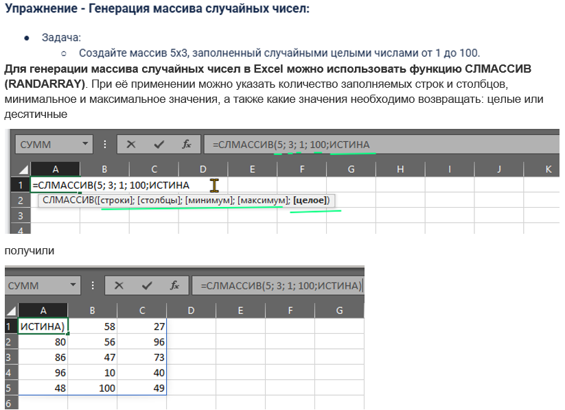
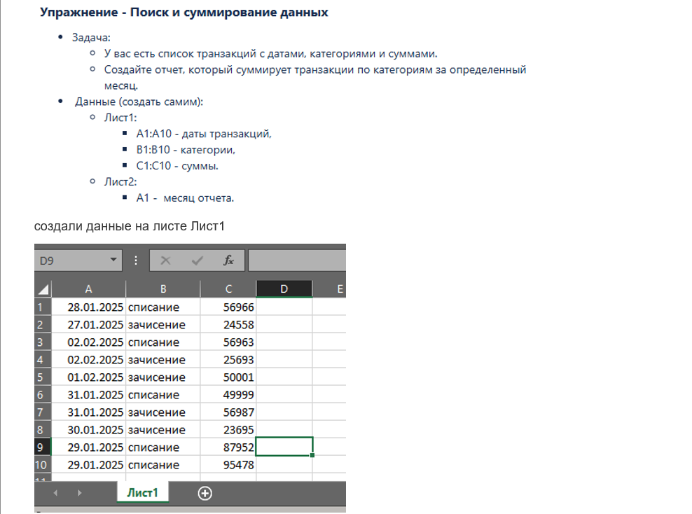
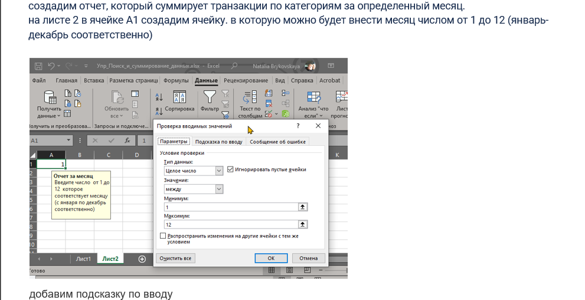
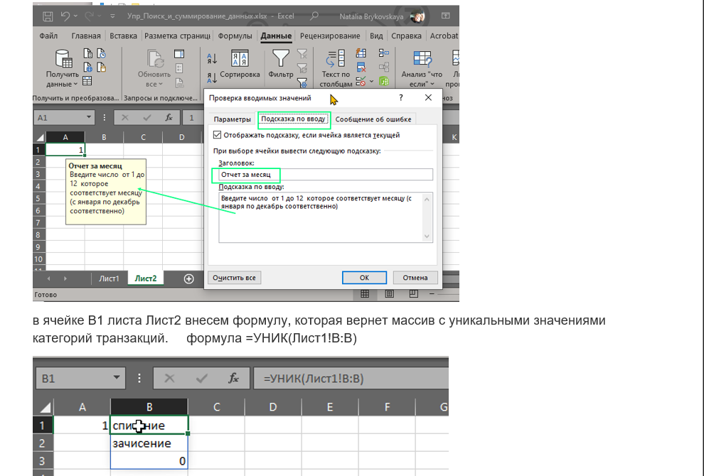
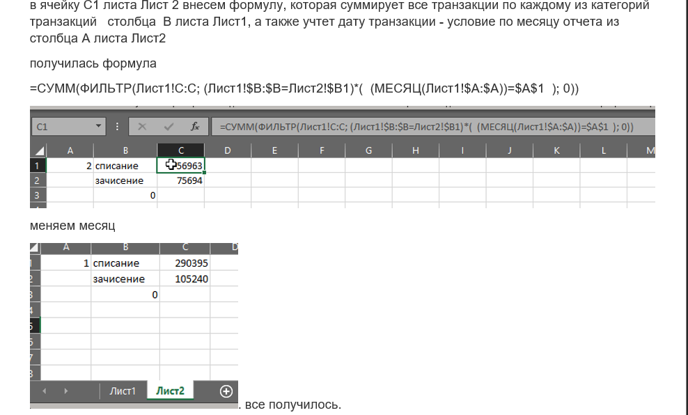
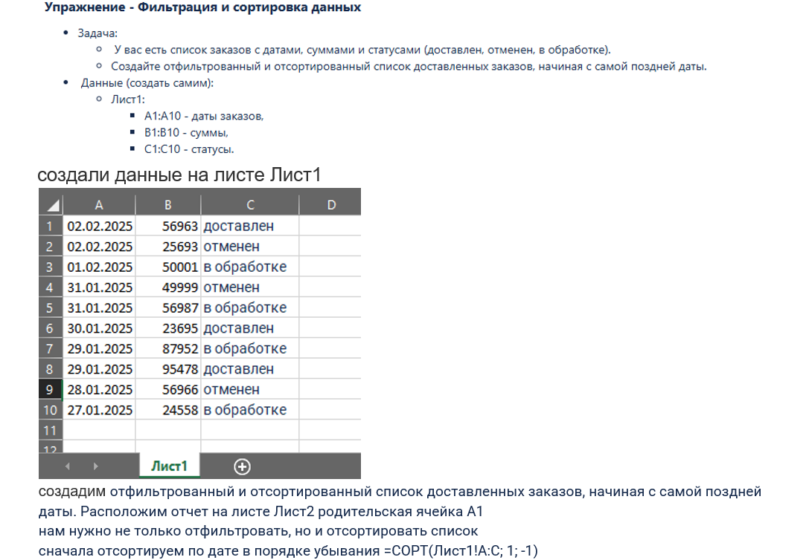
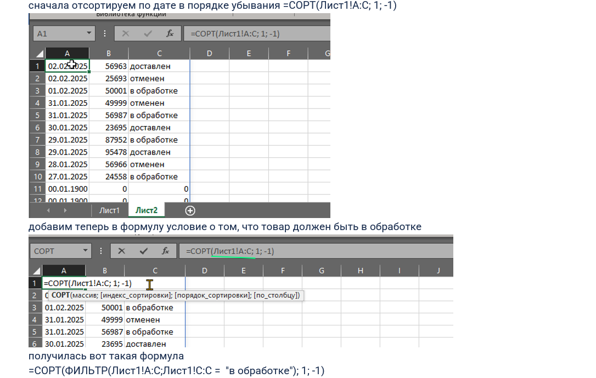

## 🦖 модуль 1. Тема: Массивные формулы и динамические массивы
### 👹задача Генерация_массива_случайных_чисел
 
[файл эксель: Упр_Генерация_массива_случайных_чисел.xlsx](files/Упр_Генерация_массива_случайных_чисел.xlsx) 

### 👹задача Поиск_и_суммирование_данных
 
 
 
 
[файл эксель: Упр_Поиск_и_суммирование_данных.xlsx](files/Упр_Поиск_и_суммирование_данных.xlsx) 
### 👹задача Фильтрация_и_сортировка_данных
 
 
 
[файл эксель: Упр_Фильтрация_и_сортировка_данных.xlsx](files/Упр_Фильтрация_и_сортировка_данных.xlsx) 