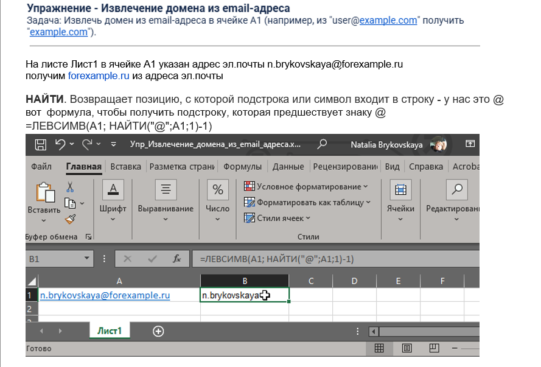
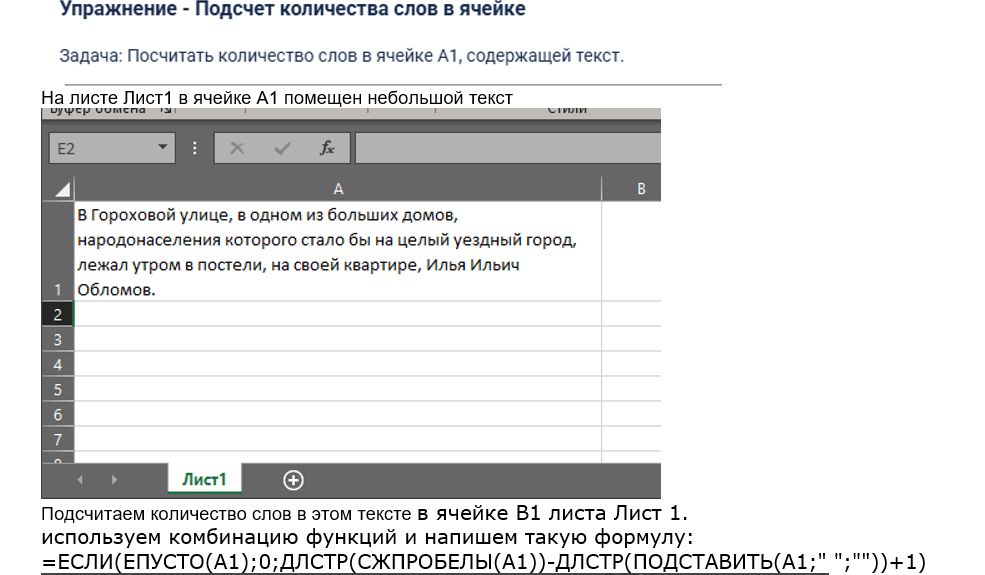
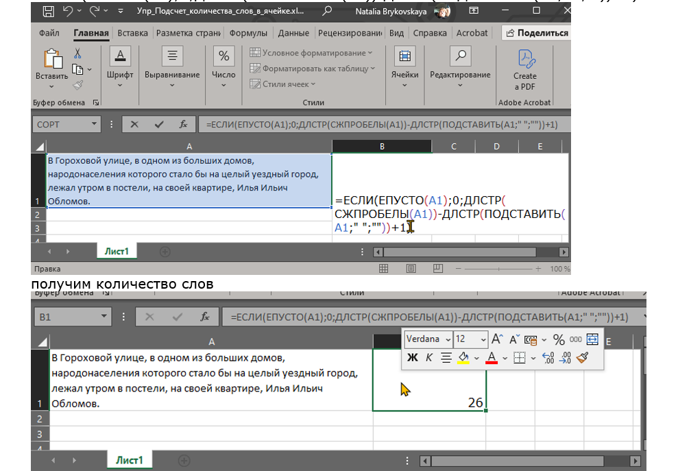
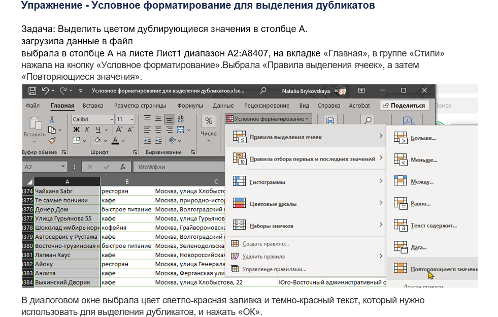
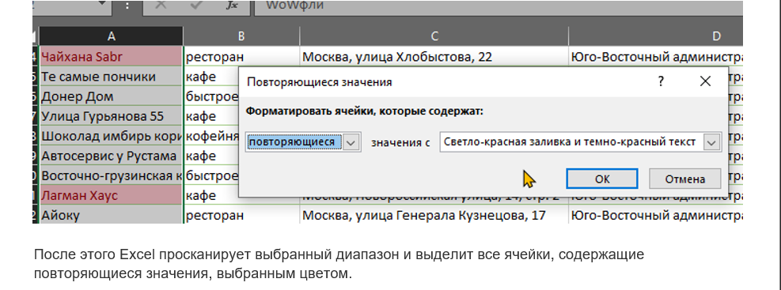
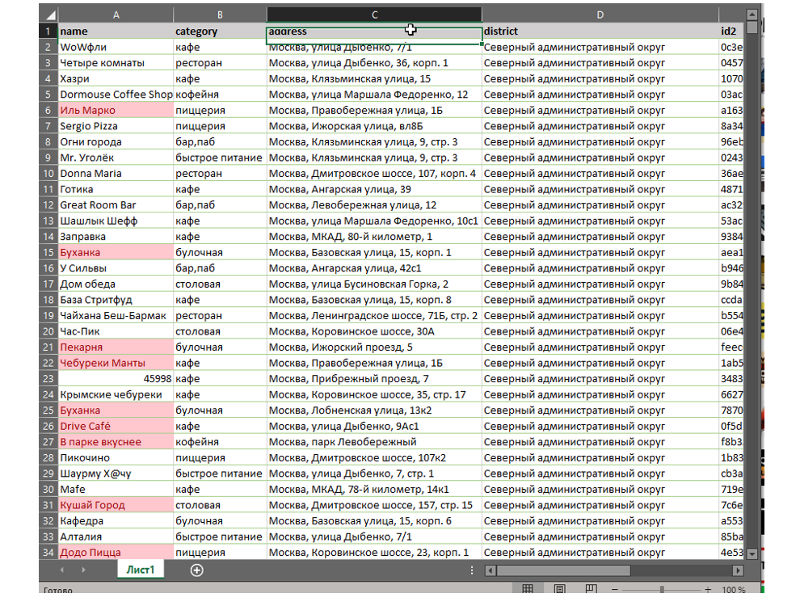
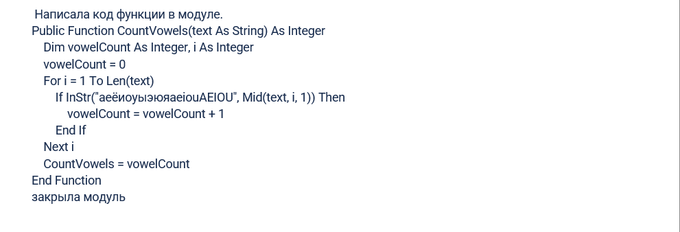
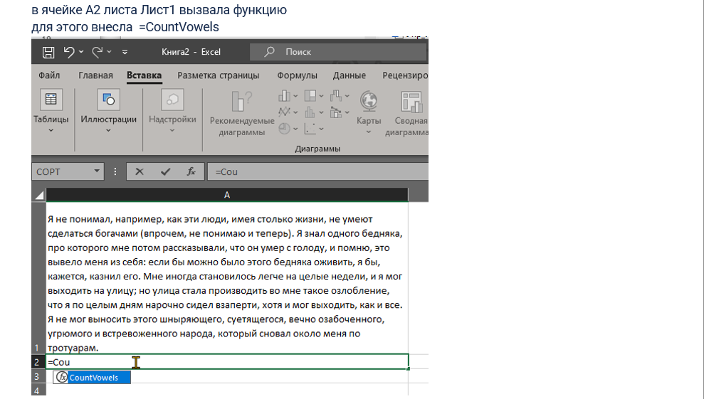
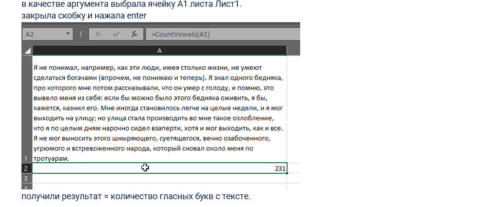

## 🦖 модуль 1. Тема: Нестандартные_формулы_и_пользовательские_функции
### 🦍задача Упр_Извлечение_домена_из_email_адреса
 
[файл эксель: Упр_Извлечение_домена_из_email_адреса.xlsx](files/Упр_Извлечение_домена_из_email_адреса.xlsx) 

### 🦍задача Упр_Подсчет_количества_слов_в_ячейке
 
 
[файл эксель:Упр_Подсчет_количества_слов_в_ячейке.xlsx](files/Упр_Подсчет_количества_слов_в_ячейке.xlsx) 
### 🦍задача Упр_Условное_форматирование_для_выделения_дубликатов

 
 
 
 
[файл эксель:Упр_Условное_форматирование_для_выделения_дубликатов.xlsx](files/Упр_Условное_форматирование_для_выделения_дубликатов.xlsx) 
### 🦍задача Упр_Функция_ для_подсчета_количества_гласных.
 
 
 
 
 
[файл эксель:Упр_Функция_ для_подсчета_количества_гласных..xlsx](files/Упр_Функция_для_подсчета_количества_гласных..xlsx) 