# 🦖 модуль 1. 2Работа_с_данными_Power_Query
## Практическая часть блока "Работа с данными Power Query". тема:
 
## Тема: 1.Импорт_и_экспорт_данных
 - Упражнение - Импорт данных из текстового файла
 - Упражнение - Импорт данных из веб-страницы
 - Упражнение - Объединение данных из нескольких файлов Excel

### 🦍задача1  Упр_Импорт_данных_из_веб-страницы
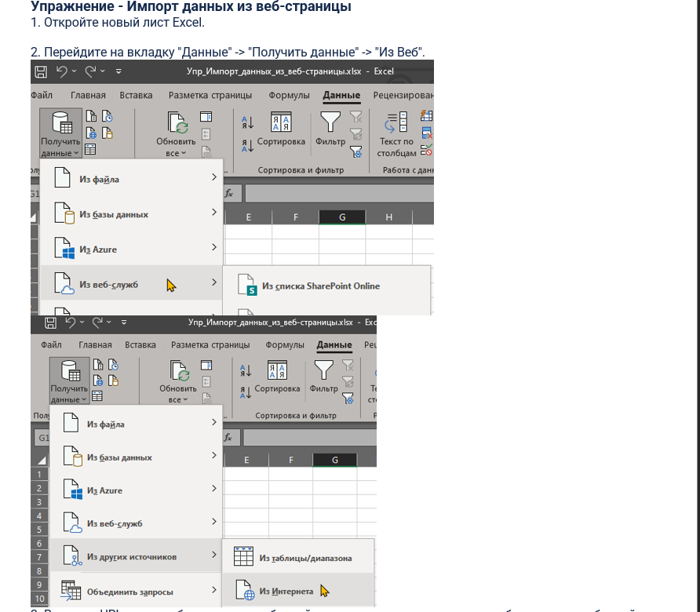 
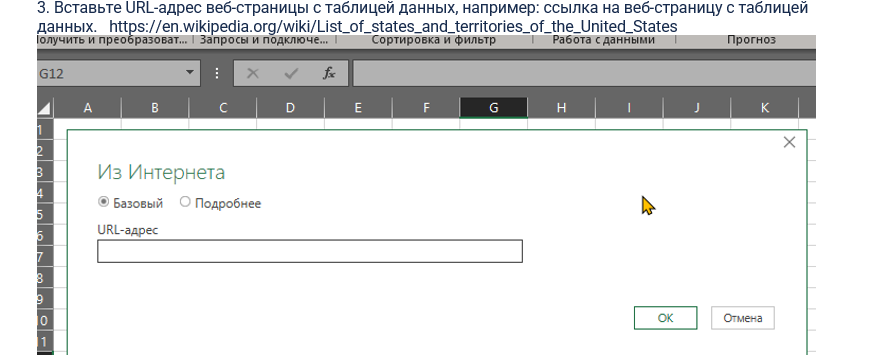 
 
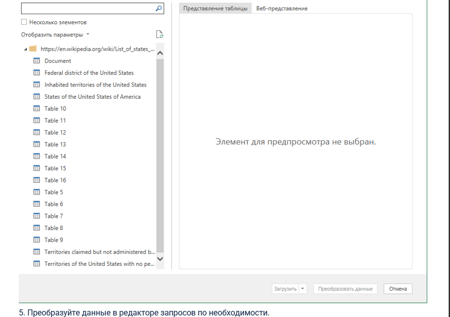 
 

[файл эксель: Упр_Импорт_данных_из_веб-страницы.xlsx](files/Упр_Импорт_данных_из_веб-страницы.xlsx)  
### 🦍задача2 Упр_Импорт_данных_из_текстового_файла
 
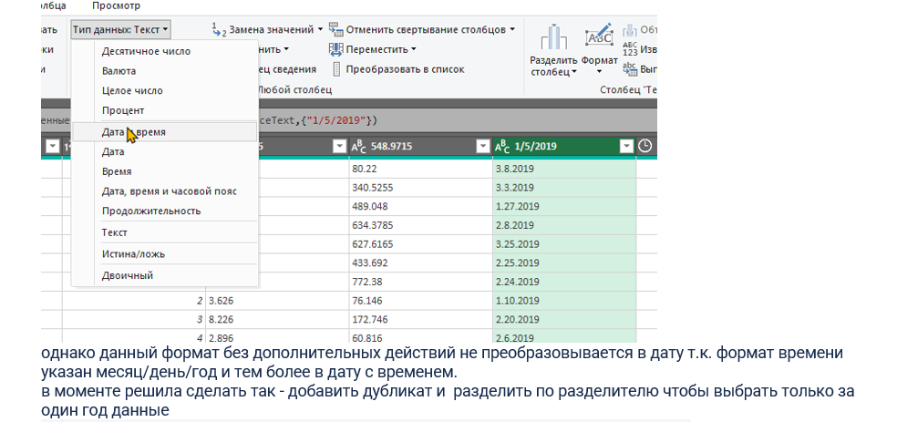 
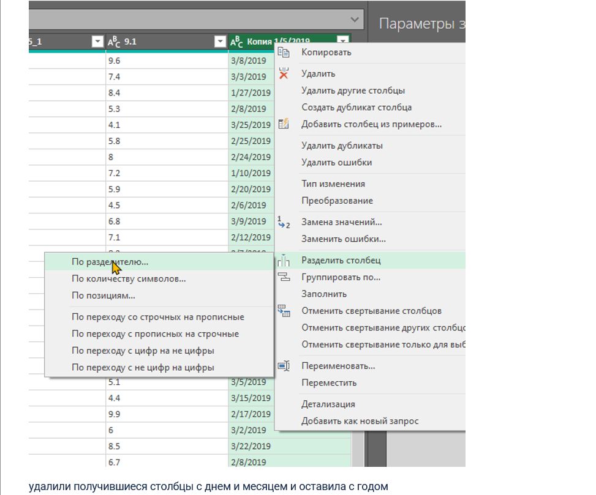 
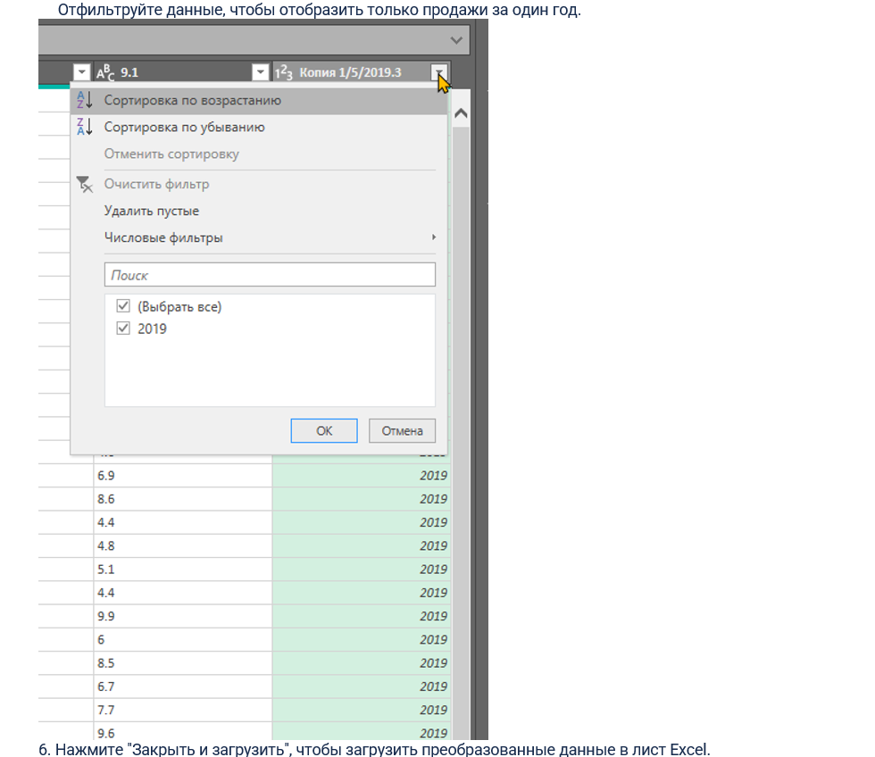 
 
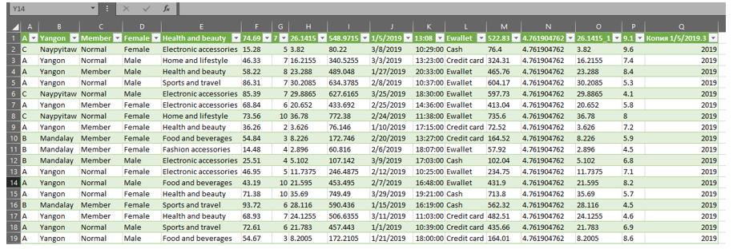 

[файл эксель: Упр_Импорт_данных_из_текстового_файла.xlsx](files/Упр_Импорт_данных_из_текстового_файла.xlsx)  
[файл: supermarket_Sales.csv](files/supermarket_Sales.csv) 
### 🦍задача3 Упр_Объединение_данных_из_нескольких_файлов_Excel
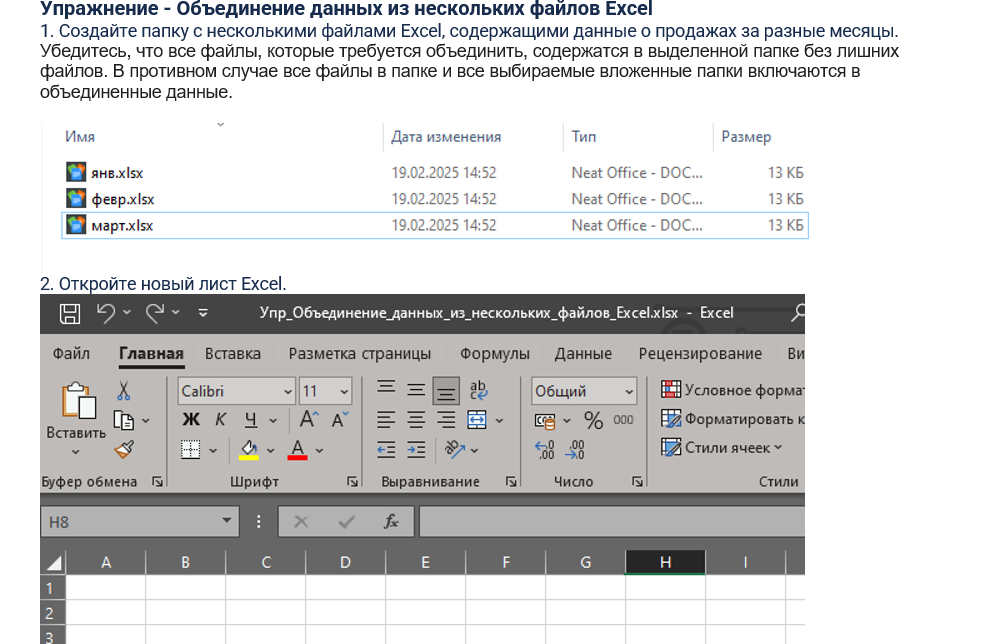 
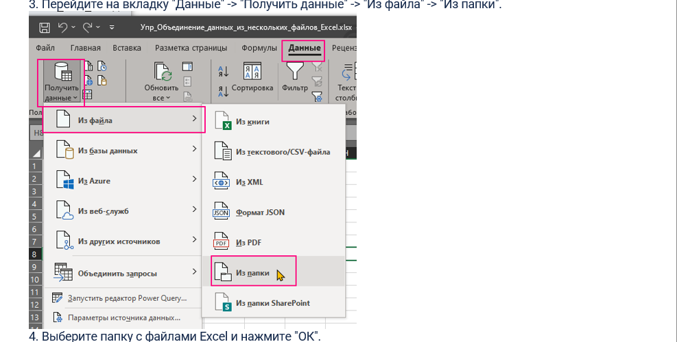 
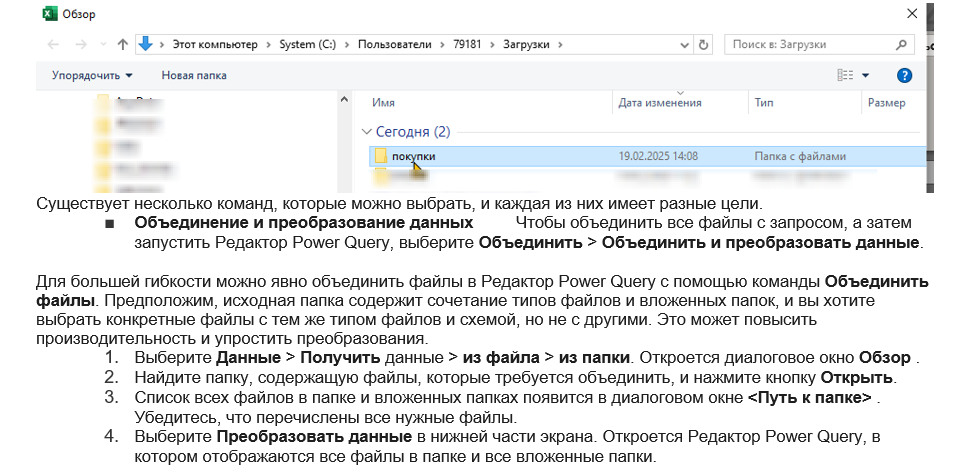 
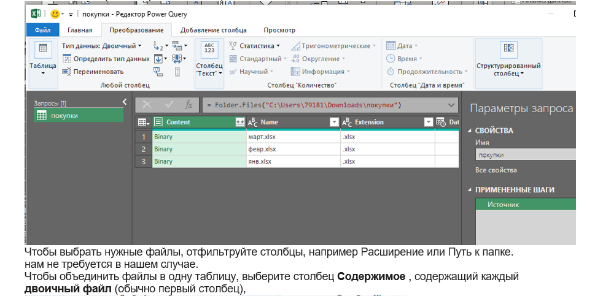 
 
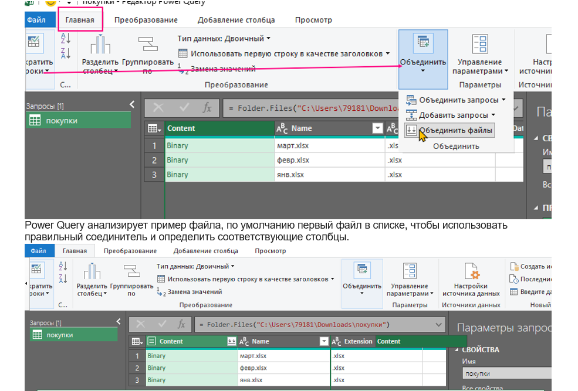 
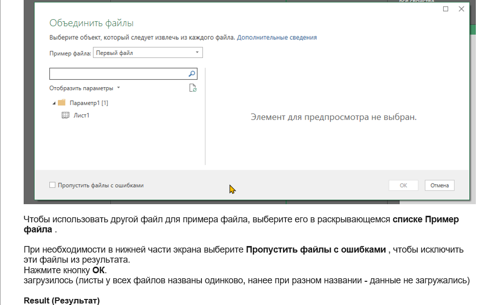 
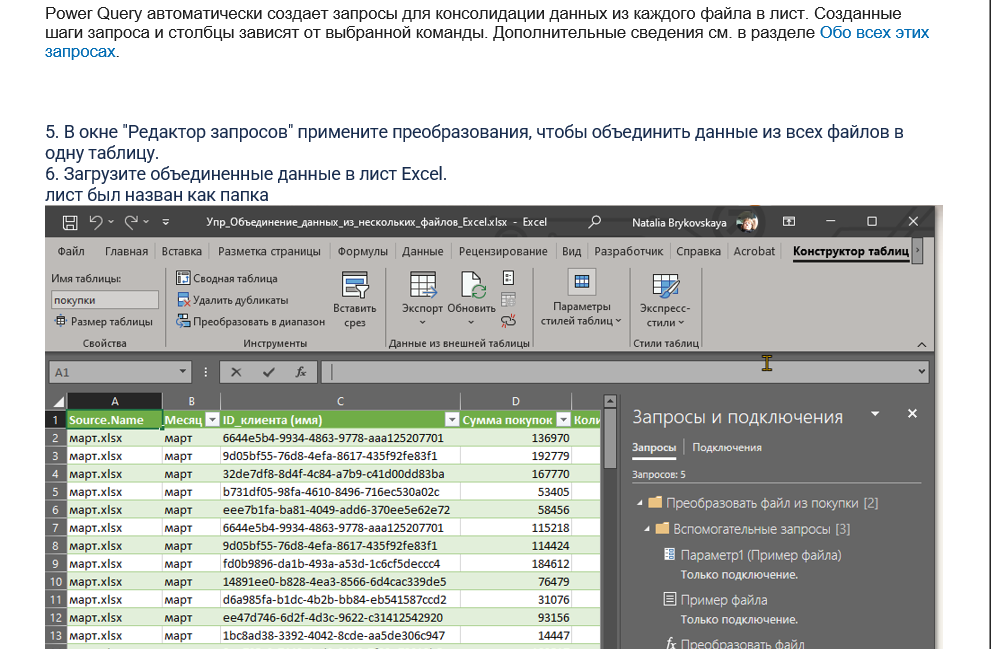 
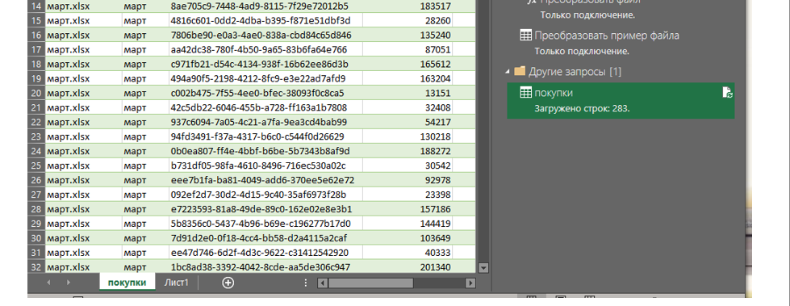 
[файл эксель: Упр_Объединение_данных_из_нескольких_файлов_Excel.xlsx](files/Упр_Объединение_данных_из_нескольких_файлов_Excel.xlsx) 