# 🦖 модуль 1. блок 2Работа_с_данными_Power_Query
## Тема:  3. Использование Power Query для чистки данных. 

 - Упражнение - удаление лишних пробелов
 - Упражнение - замену некорректных дат на пустые значения

### 🦍задача1 Упр_PQ_для_чистки_данных
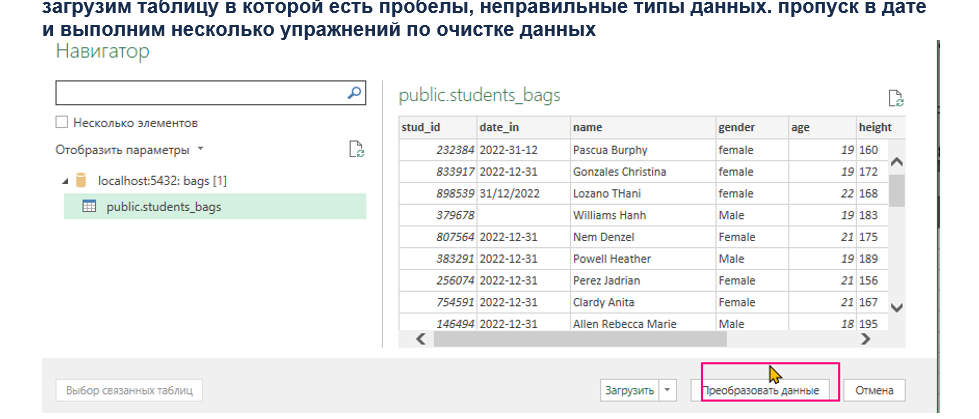<br>
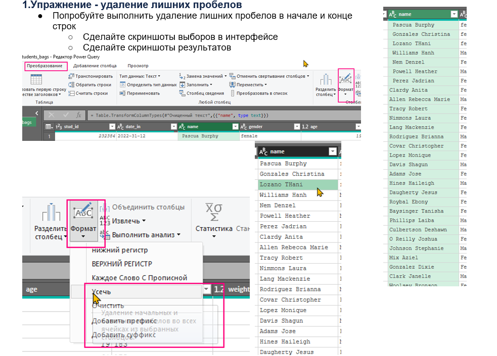<br>
<br>
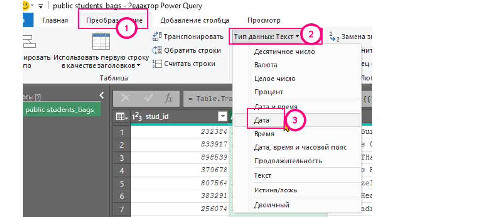<br>
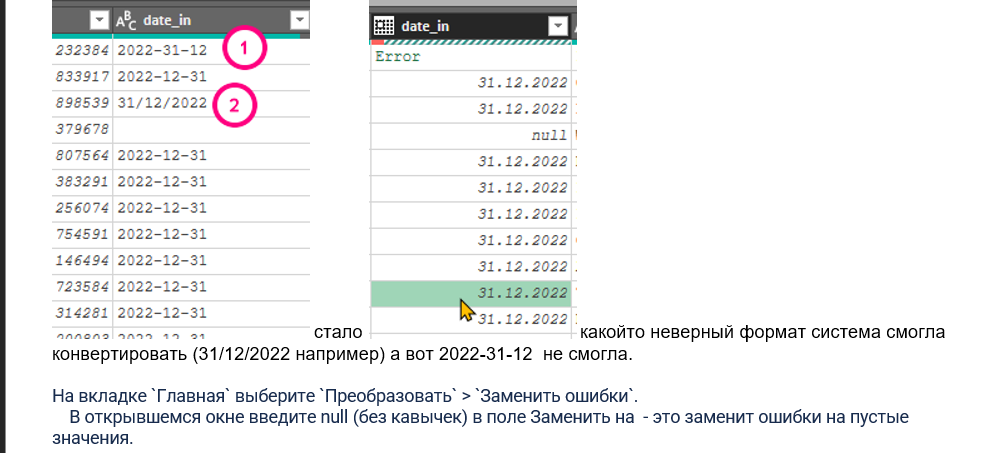<br>
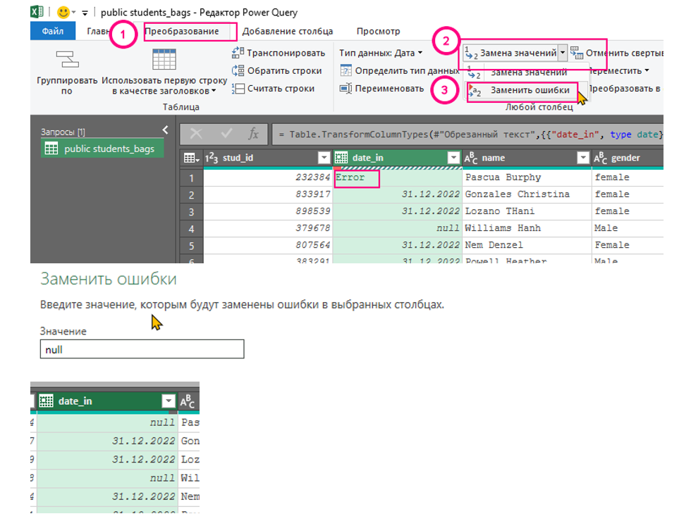<br>
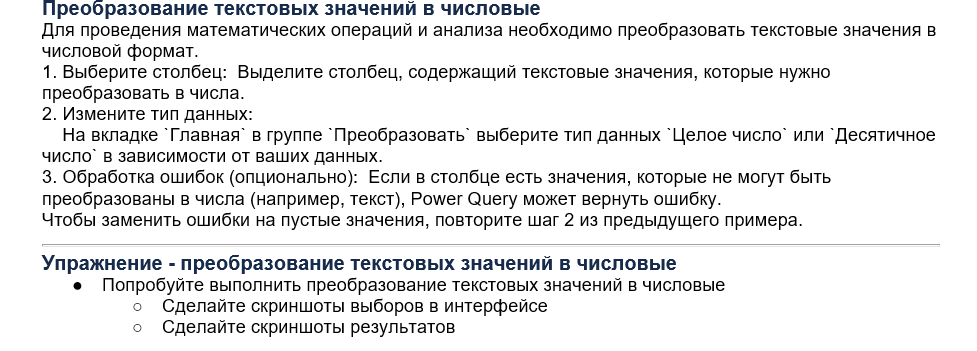<br>
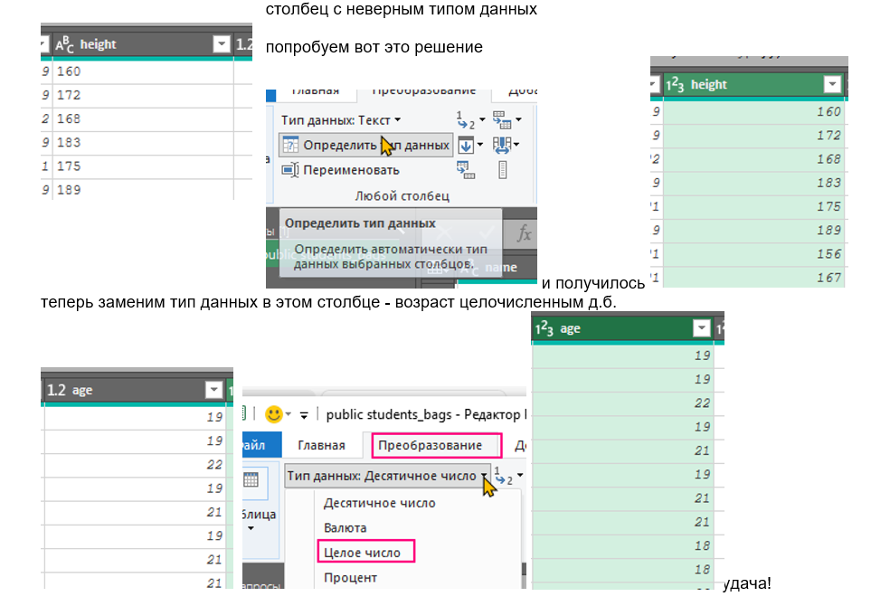<br>
<br>
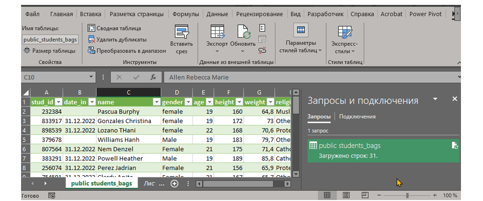<br>


[файл эксель: Упр_PQ_для_чистки_данных.xlsx](files/Упр_PQ_для_чистки_данных.xlsx)<br>
### 🦍задача2 Упр_Трансформация_данных_ удаление_дубл_фильтрация
```
Упражнение - трансформация данных в Power Query
○	Попробуйте каждый из вариантов
○	Сделайте скриншоты выборов в интерфейсе
○	Сделайте скриншоты результатов
Трансформация данных  в Power Query
●	Фильтрация строк и столбцов
●	Сортировка данных
●	Удаление дубликатов строк
●	Замена значений и ошибок
●	Разбиение и объединение столбцов
●	Группировка данных и агрегация
●	Добавление пользовательских столбцов с вычисляемыми значениями
●	Использование формул и функций Power Query (M-язык)
РЕШЕНИЕ
загрузим таблицу
```
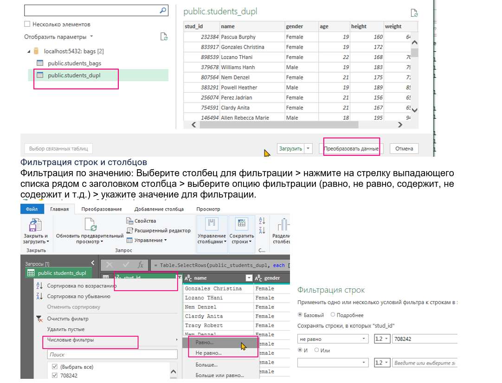<br>
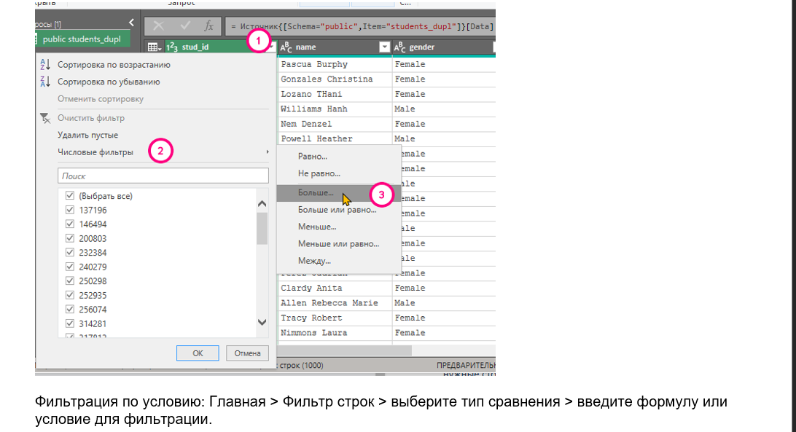<br>
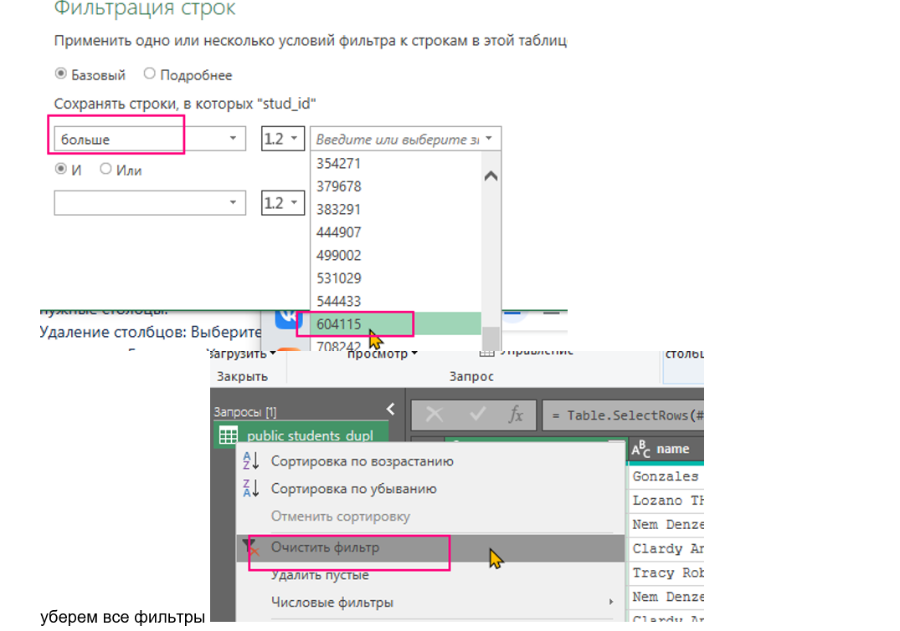<br>
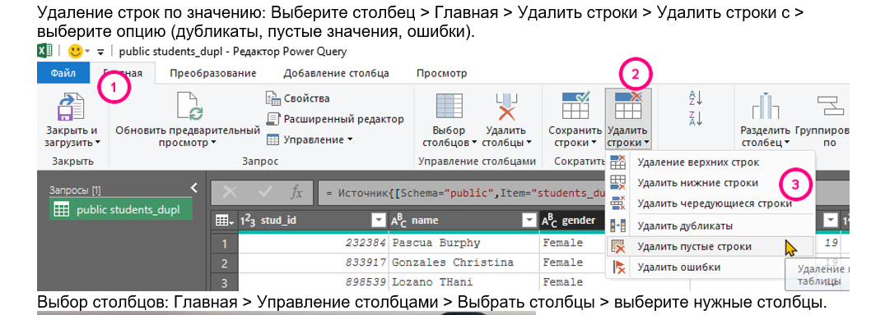<br>
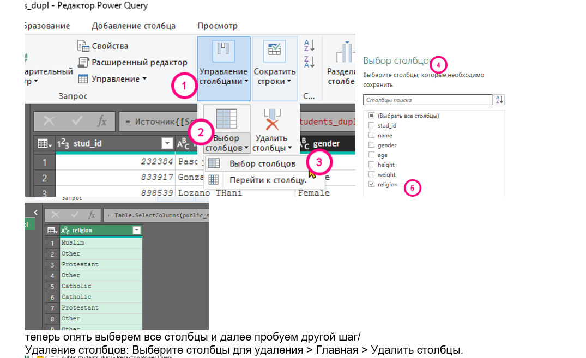<br>
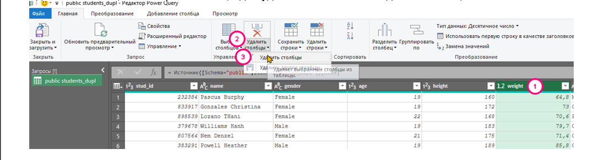<br>

[файл эксель: Упр_Трансформация_данных_ удаление_дубл_фильтрация.xlsx](files/Упр_Трансформация_данных_удаление_дубл_фильтрация.xlsx)<br>