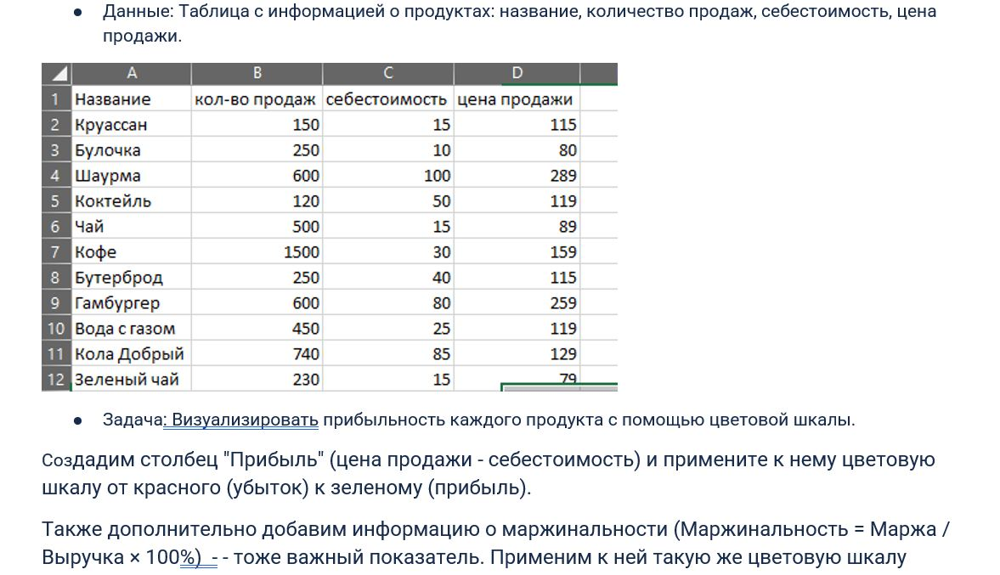
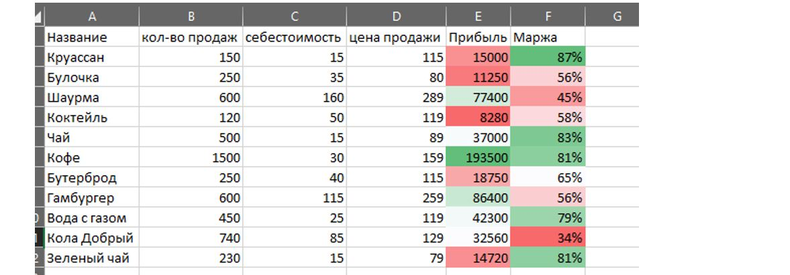
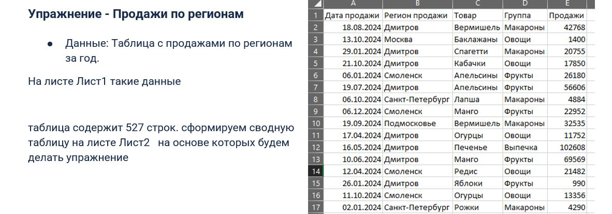
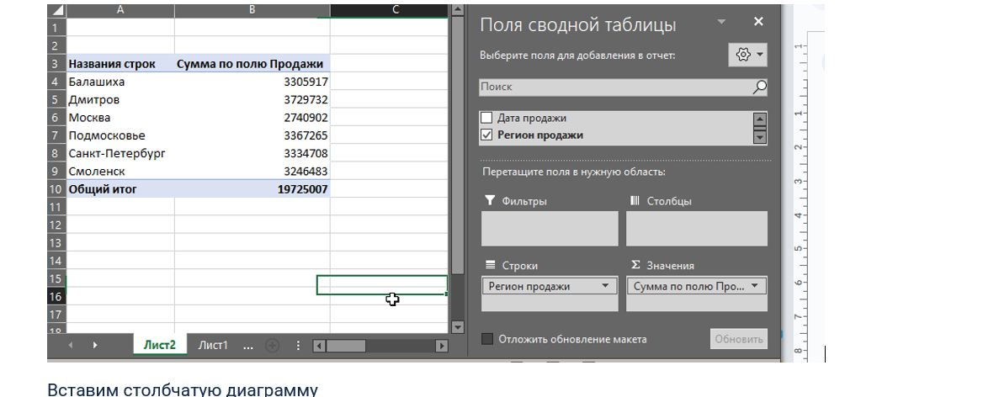
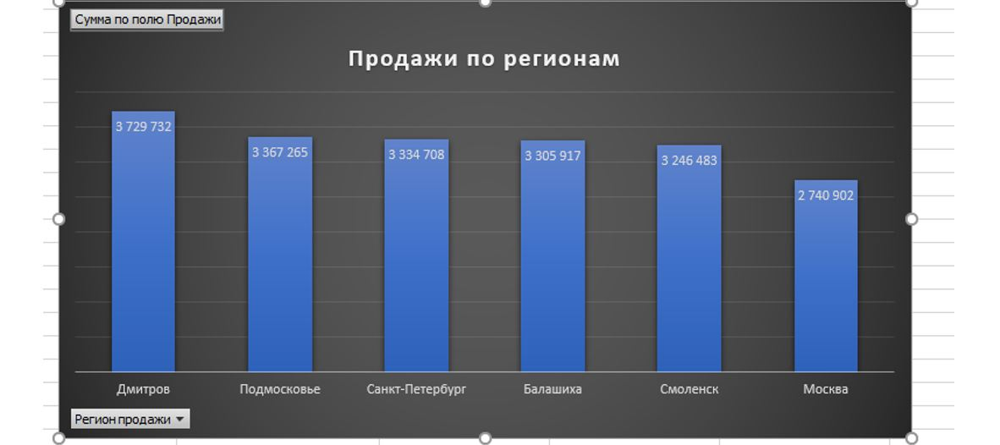
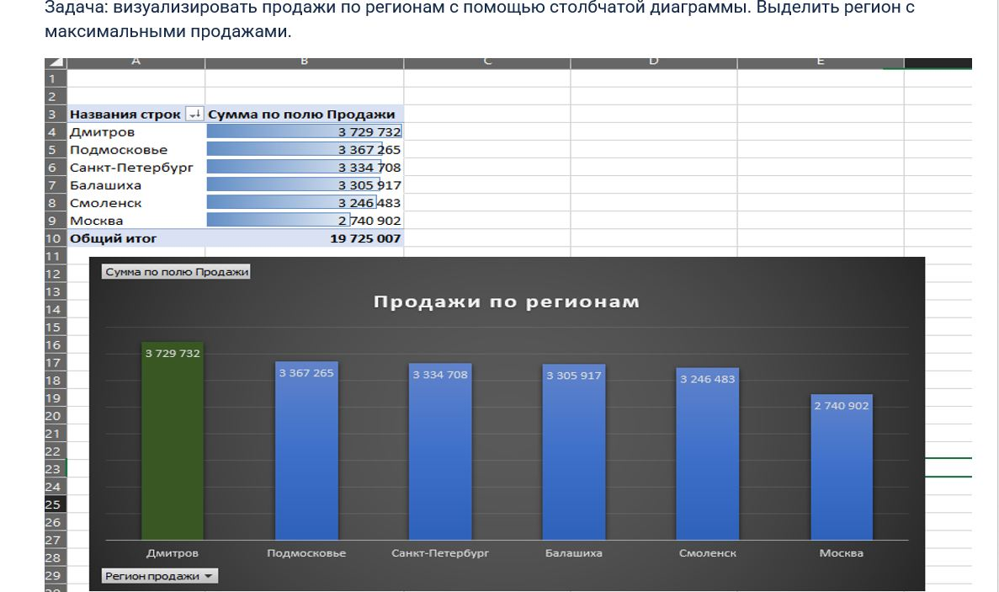

# 🦖 модуль 1. PQ_PBI_Excel
# 3Советы_по_визуализации_в_Excel .
## ТЕМА: Использование_условного_форматирования
### 🦍 Упражнение - Анализ прибыльности продуктов

 
 
[файл эксель: Упр_Анализ_прибыльности_продуктов.xlsx](files/Упр_Анализ_прибыльности_продуктов.xlsx)  
### 🦍 Упражнение - Продажи по регионам
 
 
 
 
[файл эксель: Упр_Продажи_по_регионам.xlsx](files/Упр_Продажи_по_регионам.xlsx)  