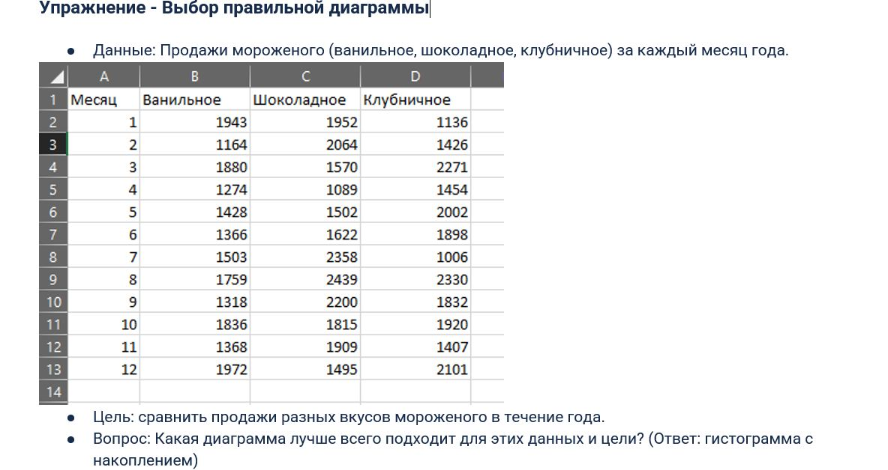
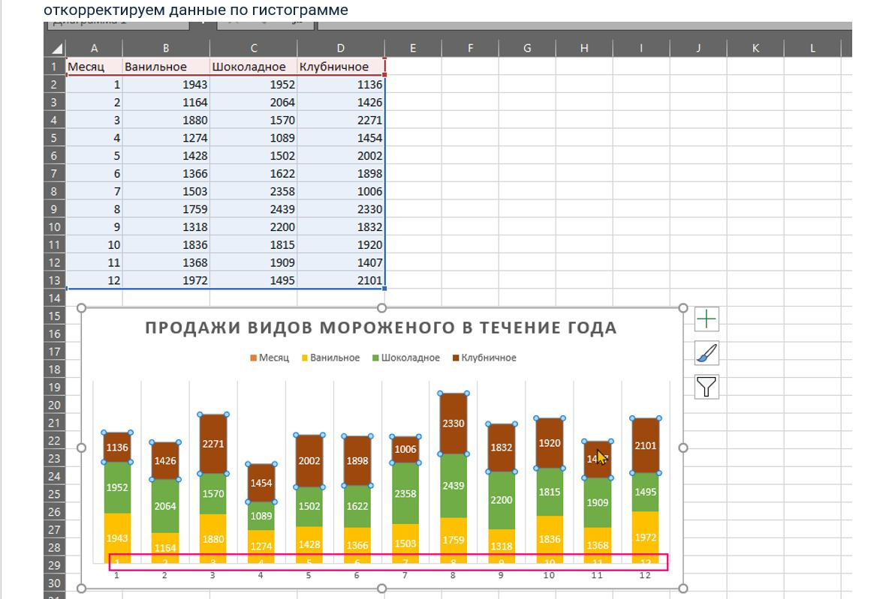
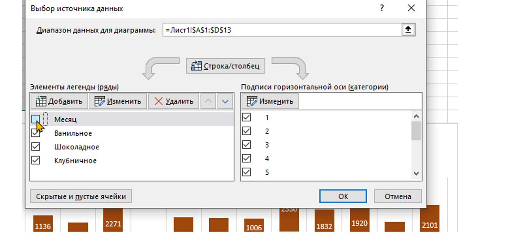
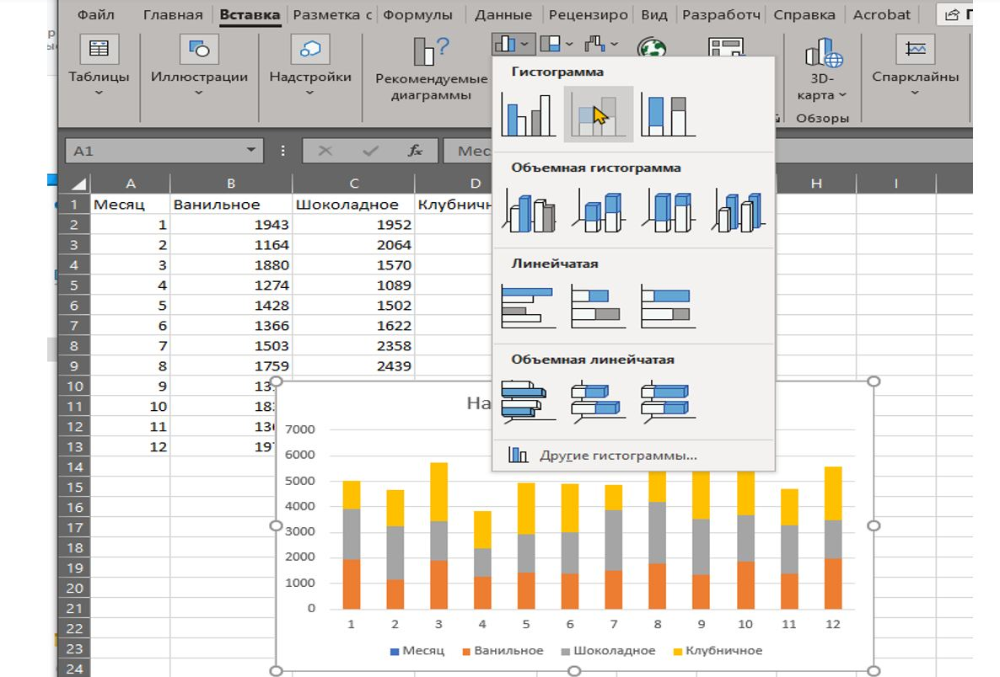
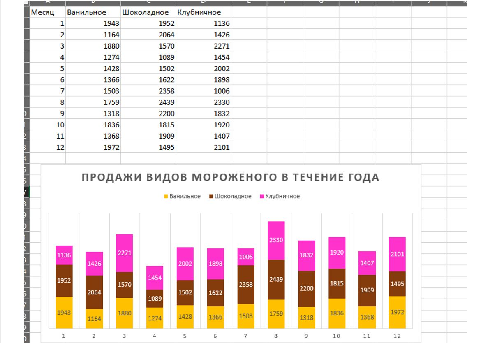
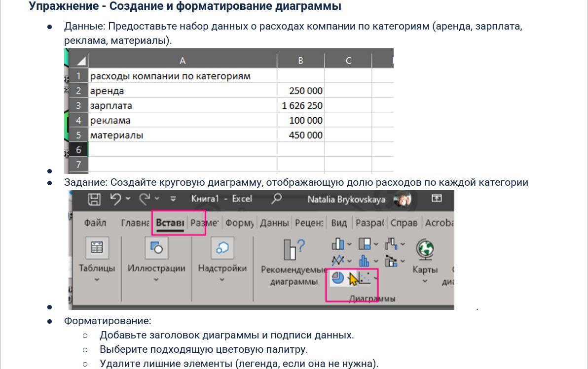
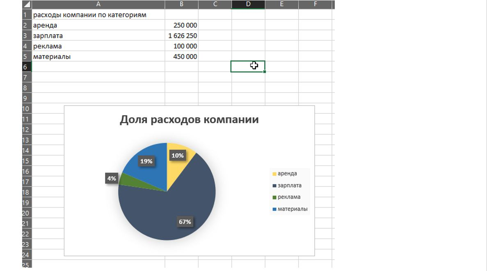
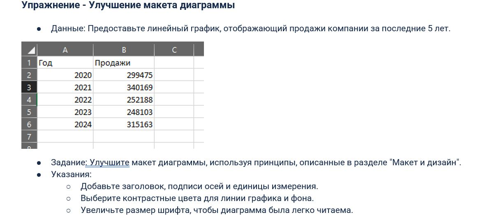
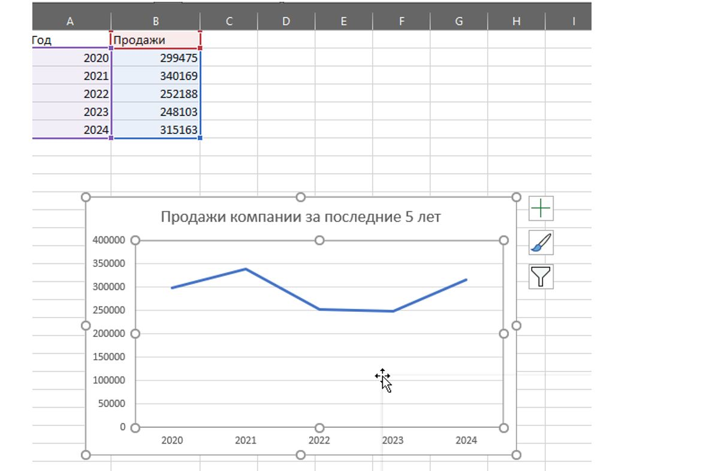
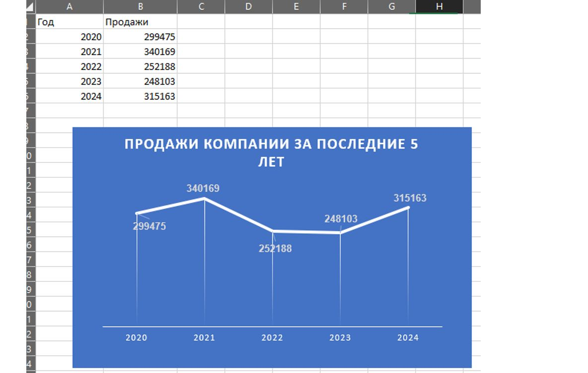

#🦖 модуль 1. PQ_PBI_Excel

# 3Советы_по_визуализации_в_Excel .

## ТЕМА:Макеты_и_диаграммы
### 🦍задача1  Упр_Выбор_правильной_диаграммы

 
 
 
 
 

[файл эксель: Упр_Выбор_правильной_диаграммы.xlsx](files/Упр_Выбор_правильной_диаграммы.xlsx)  

### 🦍задача 2 Упр_Создание_и_форматирование_диаграммы
 
 
[файл эксель: Упр_Создание_и_форматирование_диаграммы.xlsx](files/Упр_Создание_и_форматирование_диаграммы.xlsx)  

### 🦍задача 3 Упр_Улучшение_макета_диаграммы
 
 
 
[файл эксель: Упр_Улучшение_макета_диаграммы.xlsx](files/Упр_Улучшение_макета_диаграммы.xlsx)  

